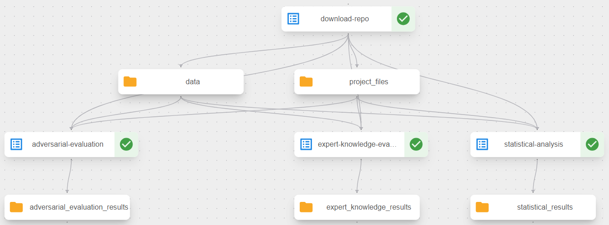
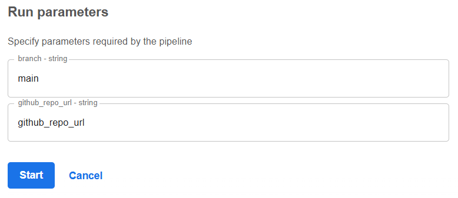

# REALM Task 5.1 Post-Market Evaluation - COPowereD Use Case


## General Task Description

Components developed in Task 5.1 focus on the post-market evaluation of synthetically generated medical data that are used in various medical applications such as lung tumor segmentation, pharmacogenomics, COPD prediction, etc.

The post-market evaluation is performed to ensure that the synthetic data generated is of high quality and is similar to the real data. To evaluate the quality of the synthetic data, examination along three main axes is performed:

1. **Expert Knowledge**: Evaluates the synthetic data based on domain-specific rules and medical knowledge to ensure anatomical correctness and clinical validity.
2. **Statistical Analysis**: Examines statistical and distributional properties of the synthetic data to ensure their validity from a statistical standpoint.
3. **Adversarial Evaluation**: Compares the performance of SOTA machine/deep learning models on the synthetic data with their performance on the real data to ensure that the two datasets (real and synthetic) yield comparable results.


## Use Case 5 Specific Description

This repository implements a comprehensive post-market evaluation pipeline for synthetic COPowereD (COPD triage prediction) tabular data, analyzing their quality and similarity to real-world clinical data through three distinct evaluation approaches.

Key Components:

- **Expert Knowledge Evaluation**: Validates synthetic clinical data against established medical ranges and domain expertise based on comprehensive clinical literature. The evaluation checks if biomarker values fall within clinically acceptable ranges including:

    - Heart rate (baseline and current): 20-280 beats per minute (bpm). Normal adult heart rate ranges from 60-100 bpm according to Avram et al., 2019 [1]. The lower bound of 20 bpm accounts for extreme bradycardia cases, with Mangrum & DiMarco, 2000 [2] defining sleep bradycardia at 30-35 bpm and Lesser et al., 2003 [3] documenting severe bradycardia below 40 bpm. The upper bound captures extreme tachycardia, with Patti et al., 2025 [4] reporting supraventricular tachycardia in the range of 150-220 bpm and Page et al. (2016) [5] documenting Atrioventricular Nodal Reentrant Tachycardia exceeding 250 bpm.

    - Oxygen saturation (baseline and current): 65-100%. Normal SpO2 levels range from 95-100%, with values below 90% considered hypoxemia according to Torp et al., 2017 [6]. The lower bound of 65% accounts for extreme hypoxemia cases. Tobin et al., 2020 [7] note that oxygen saturations of 80-85% are considered life-threatening, and report that individuals at high altitude can experience oxygen saturations of 65% for prolonged periods.

    - Age: 0-120 years, encompassing the full human lifespan with the upper bound accounting for cases of extreme longevity.

    - Gender: Binary values 0 (female) and 1 (male), representing biological sex categories used in the training dataset from Swaminathan et al. (2017) [8].
    
    - Height: 0-250 cm based on anthropometric data, with the upper bound accounting for extreme cases of gigantism.
    
    - Weight: 0-500 kg based on clinical observations, with the upper bound capturing extreme cases.
    
    - BMI: 0-80 kg/m² based on clinical classifications, accounting for extreme cases though such values are exceptionally rare.
    
    - COPD GOLD Stage: Categorical values 1-4 representing COPD severity stages according to the Global Initiative for Chronic Obstructive Lung Disease (GOLD) classification system.
    
    - Symptom categories: Worsening (0-3), Shortness of breath (1-3), Cough (1-3), Sputum (0-3) representing various symptom severities relative to baseline.


- **Statistical Analysis**: Conducts comprehensive data quality assessment by:
    - Detecting missing values throughout the dataset and identifying affected rows.    
    - Validating column consistency against expected schema from configuration.
    - Checking data type consistency (numeric, categorical columns).    
    - Identifying duplicate column names and duplicate rows in the dataset.
    - Generating detailed reports of data quality issues and anomalies.


- **Adversarial Evaluation**: Compares model performance between real-world and synthetic clinical data using:
    - The COPowereD prediction model API for COPD patient triage.
    - Classification metrics (accuracy, precision, recall, F1-score) for quantitative comparison.
    - Performance difference analysis between synthetic and real-world data.
    - Evaluation of whether synthetic data maintains comparable predictive utility.


## Prerequisites

1. Python version must be 3.13 or higher.
2. Create a virtual environment and install the dependencies using the [requirements.txt](./requirements.txt) file: `pip install -r requirements.txt`.
4. API access to the COPowereD model endpoint.


## Data Structure

The `COPowereD` model works with tabular clinical biomedical data for COPD patients. The dataset includes both features and a binary target `label` column (0 or 1) representing the need for medical attention.

### Input Data Format

The input data is expected to be in CSV format with clinical features and a label column (example rows):

| id | Gender | Age | Height | Weight | BMI | b_COPD | b_HeartRate | b_SPO2 | s_Worsening | s_Breath | s_Cough | s_Sputum | c_HeartRate | c_SPO2 | label |
|----|--------|-----|--------|--------|-----|--------|-------------|--------|-------------|----------|---------|----------|-------------|--------|-------|
| 0  | 1      | 65  | 175    | 80     | 26.1| 2      | 75          | 95     | 1           | 2        | 2       | 1        | 82          | 93     | 1     |
| 1  | 0      | 58  | 162    | 68     | 25.9| 1      | 68          | 97     | 0           | 1        | 1       | 0        | 70          | 96     | 0     |

**Note**: The evaluation scripts automatically separate the `label` column from the features for processing.


## Running the COPowereD Model

The COPowereD model is accessible via a REST API. Use the following command to make predictions:

```bash
curl -X POST https://canalytics.comunicare.io/api/prediction \
  -H "Content-Type: application/json" \
  -d '{
  "methods": [
    {
      "project": "BpcoTriagingBinary",
      "algo": "MLGBTPipeline",
      "version": "0.0.1"
    }
  ],
  "observations": [
    {
      "subject": {
        "reference": "patient_001"
      },
      "component": [
        {
          "valueQuantity": {"value": 1},
          "code": {
            "coding": [{"code": "46098-0", "display": "sex", "system": "http://loinc.org"}]
          }
        },
        {
          "valueQuantity": {"value": 65},
          "code": {
            "coding": [{"code": "63900-5", "display": "Current age or age at death", "system": "http://loinc.org"}]
          }
        },
        {
          "valueQuantity": {"value": 175},
          "code": {
            "coding": [{"code": "8302-2", "display": "Body height", "system": "http://loinc.org"}]
          },
          "instant": "baseline"
        },
        {
          "valueQuantity": {"value": 80},
          "code": {
            "coding": [{"code": "3141-9", "display": "Body Weight", "system": "http://loinc.org"}]
          },
          "instant": "baseline"
        },
        {
          "valueQuantity": {"value": 26.1},
          "code": {
            "coding": [{"code": "39156-5", "display": "Body mass index", "system": "http://loinc.org"}]
          },
          "instant": "baseline"
        },
        {
          "valueQuantity": {"value": 2},
          "code": {
            "coding": [{"code": "13645005", "display": "COPD Gold stage", "system": "http://snomed.info/sct"}]
          },
          "instant": "baseline"
        },
        {
          "valueQuantity": {"value": 75},
          "code": {
            "coding": [{"code": "8867-4", "display": "Heart rate baseline", "system": "http://loinc.org"}]
          },
          "instant": "baseline"
        },
        {
          "valueQuantity": {"value": 95},
          "code": {
            "coding": [{"code": "20564-1", "display": "Oxygen saturation baseline", "system": "http://loinc.org"}]
          },
          "instant": "baseline"
        },
        {
          "valueQuantity": {"value": 1},
          "code": {
            "coding": [{"code": "275723000", "display": "Deteriorating condition", "system": "http://snomed.info/sct"}]
          }
        },
        {
          "valueQuantity": {"value": 2},
          "code": {
            "coding": [{"code": "267036007", "display": "Dyspnea", "system": "http://snomed.info/sct"}]
          }
        },
        {
          "valueQuantity": {"value": 2},
          "code": {
            "coding": [{"code": "49727002", "display": "Cough", "system": "http://snomed.info/sct"}]
          }
        },
        {
          "valueQuantity": {"value": 1},
          "code": {
            "coding": [{"code": "248595008_365445003", "display": "Sputum : Volume and Color", "system": "http://snomed.info/sct"}]
          }
        },
        {
          "valueQuantity": {"value": 82},
          "code": {
            "coding": [{"code": "8867-4", "display": "Heart rate", "system": "http://loinc.org"}]
          }
        },
        {
          "valueQuantity": {"value": 93},
          "code": {
            "coding": [{"code": "20564-1", "display": "Oxygen saturation", "system": "http://loinc.org"}]
          }
        }
      ]
    }
  ]
}'
```

An example response is shown below: 

```json
{
  "success": true,
  "message": null,
  "data": [
    {
      "subject": {
        "reference": "patient_001"
      },
      "identifier": [
        {
          "value": "Risk_Copd_Triaging_Binary",
          "system": "http://comunicare.io"
        }
      ],
      "prediction": [
        {
          "outcome": {
            "coding": [
              {
                "code": "needMedicalAttention",
                "display": "Need for medical attention",
                "system": "http://comunicare.io"
              }
            ]
          },
          "rationale": "GBTP",
          "probabilityDecimal": 0.5320359882519113,
          "order": 1,
          "version": "0.0.1"
        },
        {
          "outcome": {
            "coding": [
              {
                "code": "notNeedMedicalAttention",
                "display": "No need for medical attention",
                "system": "http://comunicare.io"
              }
            ]
          },
          "rationale": "GBTP",
          "probabilityDecimal": 0.46796401174808866,
          "order": 0,
          "version": "0.0.1"
        },
        {
          "outcome": {
            "coding": [
              {
                "code": "notNeedMedicalAttention",
                "display": "No need for medical attention",
                "system": "http://comunicare.io"
              }
            ]
          },
          "rationale": "summary",
          "probabilityDecimal": 0.46796401174808866,
          "order": 0
        },
        {
          "outcome": {
            "coding": [
              {
                "code": "needMedicalAttention",
                "display": "Need for medical attention",
                "system": "http://comunicare.io"
              }
            ]
          },
          "rationale": "summary",
          "probabilityDecimal": 0.5320359882519113,
          "order": 1
        }
      ],
      "statut": "final"
    }
  ]
}
```

The response includes:

- `success`: Boolean indicating if the API call was successful.
- `message`: Error message (null if successful).
- `data`: Array containing prediction results for each patient.
    - `subject`: Patient reference ID.
    - `identifier`: Model identification information.
    - `prediction`: Array of predictions with both GBTP model results and summary results.
        - `outcome`: The predicted class code (`needMedicalAttention` or `notNeedMedicalAttention`).
        - `probabilityDecimal`: Probability score for the predicted class.


## Post-Market Evaluation Report

Each evaluation component can be executed independently.

### Expert Knowledge Evaluation

Validates synthetic data against clinical ranges and medical domain knowledge using the [src/expert_knowledge.py](./src/expert_knowledge.py):

```bash
python src/expert_knowledge.py --synth_data /path/to/synth/synth_data.csv --output output/expert_knowledge_evaluation_results.json
```

**Arguments:**
- `--synth_data`: Path to synthetic data CSV file.
- `--output`: Output JSON file path (default: `output/expert_knowledge_evaluation_results.json`).

**Output Format:**
```json
{
    "Information": "Clinical validation description...",
    "Valid Rows": [0, 2, 3, 4, 5, 6, 7, 9],
    "Invalid Rows": {
        "1": {
            "id": 1,
            "Gender": 0,
            "Age": 65,
            "Height": 160,
            "Weight": 70,
            "BMI": 27.3,
            "b_COPD": 2,
            "b_HeartRate": 300,
            ...
        }
        ...
    }
}
```

### Statistical Analysis

Performs comprehensive data quality assessment using the [src/statistical_analysis.py](./src/statistical_analysis.py):

```bash
python src/statistical_analysis.py --synth_data /path/to/synth/synth_data.csv --output output/statistical_analysis_results.json
```

**Arguments:**
- `--synth_data`: Path to synthetic data CSV file.
- `--output`: Output JSON file path (default: `output/statistical_analysis_results.json`).

**Output Format:**
```json
{
    "information": "Statistical analysis description...",
    "missing_values": {
        "total_missing_values": 3,
        "indices_with_missing_values": [1, 5, 8],
        "missing_values_per_column": {
            "id": 0,
            "Gender": 0,
            "Age": 1,
            "b_HeartRate": 2,
            ...
        }
    },
    "columns_consistency": {
        "missing_columns": ["id"],
        "inconsistent_columns": ["extra_feature"]
    },
    "data_types_consistency": {
        "number_inconsistent_data_types": 1,
        "data_types_issues": {
            "Height": {
                "expected": "numeric",
                "actual": "object",
                "issue": "Not numeric"
            }
        }
    },
    "duplicate_rows_indices": [3, 7]
}
```

### Adversarial Evaluation

Compares model performance between synthetic and real-world data using the [src/adversarial_evaluation.py](./src/adversarial_evaluation.py):

```bash
python src/adversarial_evaluation.py \
    --synth_data /path/to/synth/synth_data.csv \
    --rwd_data /path/to/rwd/rwd_data.csv \
    --output output/adversarial_evaluation_results.json
```

**Arguments:**
- `--synth_data`: Path to synthetic data CSV file.
- `--rwd_data`: Path to real-world data CSV file.
- `--output`: Output JSON file path (default: `output/adversarial_evaluation_results.json`).

**Output Format:**
```json
{
    "information": "Adversarial evaluation description...",
    "Accuracy": {
        "rwd": 0.83,
        "synthetic": 0.81,
        "difference": "2.0pp"
    },
    "Precision": {
        "rwd": 0.84,
        "synthetic": 0.79,
        "difference": "5.0pp"
    },
    "Recall": {
        "rwd": 0.62,
        "synthetic": 0.65,
        "difference": "3.0pp"
    },
    "F1-Score": {
        "rwd": 0.71,
        "synthetic": 0.69,
        "difference": "2.0pp"
    }
}
```

### Understanding the Results

#### Expert Knowledge Evaluation Output
The expert knowledge evaluation validates synthetic data against clinically acceptable ranges:
- **Valid Rows**: List of row indices that pass all clinical validation checks.
- **Invalid Rows**: Dictionary mapping row indices to their complete data, showing which values fall outside acceptable clinical ranges.
- **Information**: Detailed description of the clinical literature and ranges used for validation.

#### Statistical Analysis Output
The statistical analysis provides comprehensive data quality assessment:
- **Missing Values**: Identifies total missing values, affected rows, and missing counts per column.
- **Column Consistency**: Reports missing expected columns and unexpected extra columns.
- **Data Type Consistency**: Validates that columns match expected data types (numeric, categorical).
- **Duplicate Rows**: Lists row indices of completely identical rows.

#### Adversarial Evaluation Output
The adversarial evaluation compares model performance:
- **Performance Metrics**: Accuracy, precision, recall, and F1-score for both synthetic and real-world data.
- **Performance Differences**: Calculated as the absolute difference between the synthetic and real-world performance in percentage points (pp).


## Kubeflow Pipeline Component

The [kubeflow_component/copowered_post_market_component.py](./kubeflow_component/copowered_post_market_component.py) file defines a Kubeflow pipeline for automating the COPowereD post-market evaluation workflow. This pipeline orchestrates the following components:

- **Download Component**: Downloads project files and datasets from a specified GitHub repository and branch. The pipeline expects the repo to contain the project files in the `src/` directory (`expert_knowledge.py`, `statistical_analysis.py`, `adversarial_evaluation.py`, `COPowereD_model.py`, `utils.py`, `config.json`) and the data in the `data/` folder. Inside the `data/` folder, there should be two files: `synth_data.csv` and `rwd_data.csv` (both including the `label` column).
- **Expert Knowledge Evaluation**: Executes clinical validation against medical ranges.
- **Statistical Analysis**: Performs comprehensive data quality assessment.
- **Adversarial Evaluation**: Compares model performance between synthetic and real-world data.

### Pipeline Architecture



The pipeline follows the execution pattern below:
1. **Sequential Phase**: Repository download runs first.
2. **Parallel Phase**: All three evaluation components run simultaneously after repository download completes.

### Running the Pipeline

The pipeline can be compiled and deployed to a Kubeflow environment by executing:

```bash
python kubeflow_component/copowered_post_market_component.py
```

This generates `copowered_post_market_pipeline.yaml` which can be uploaded to Kubeflow.

The generated YAML file can be used to create a new pipeline in Kubeflow by uploading the file through the Kubeflow UI.

The Kubeflow UI expects the following pipeline run parameters (arguments) when running:
- `github_repo_url`: URL of the GitHub repository containing evaluation scripts and data.
- `branch`: Git branch to use (default: `main`).



### Accessing Pipeline Results

Pipeline artifacts are stored in MinIO object storage within the Kubeflow namespace. To access these artifacts:

1. Set up port forwarding to the MinIO service by running: `kubectl port-forward -n kubeflow svc/minio-service 9000:9000`.
2. Access the MinIO web interface at `http://localhost:9000`.
3. Login with the default credentials: username: `minio`, password: `minio123`.
4. Navigate to the mlpipeline bucket, where you'll find the generated folders and files from each pipeline step, according to the automatically assigned uuid of the pipeline. (An example location could be: http://localhost:9000/minio/mlpipeline/v2/artifacts/copowered-post-market-evaluation-pipeline/81620028-c875-44ae-b0a4-98761f15645b/)


## References for the expert knowledge evaluation ranges:
1. Avram, Robert, et al. "Real-world heart rate norms in the Health eHeart study." NPJ digital medicine 2.1 (2019): 58 [ref. here](https://www.nature.com/articles/s41746-019-0134-9)
2. Mangrum, J. Michael, and John P. DiMarco. "The evaluation and management of bradycardia." New England Journal of Medicine 342.10 (2000): 703-709. [ref. here](https://www.nejm.org/doi/abs/10.1056/NEJM200003093421006)
3. Lesser, Jonathan B., et al. "Severe bradycardia during spinal and epidural anesthesia recorded by an anesthesia information management system." Anesthesiology 99.4 (2003): 859-866. [ref. here](https://europepmc.org/article/med/14508318)
4. Patti, Laryssa, Maria S. Horenstein, and John V. Ashurst. "Supraventricular tachycardia." StatPearls [Internet]. StatPearls Publishing, 2025. [ref. here](https://www.ncbi.nlm.nih.gov/books/NBK441972/)
5. Page, Richard L., et al. "2015 ACC/AHA/HRS guideline for the management of adult patients with supraventricular tachycardia: a report of the American College of Cardiology/American Heart Association Task Force on Clinical Practice Guidelines and the Heart Rhythm Society." Journal of the American College of Cardiology 67.13 (2016): e27-e115. [ref. here](https://www.jacc.org/doi/abs/10.1016/j.jacc.2015.08.856)
6. Torp, Klaus D., Pranav Modi, and Leslie V. Simon. "Pulse oximetry." (2017). [ref. here](https://europepmc.org/article/nbk/nbk470348)
7. Tobin, Martin J., Franco Laghi, and Amal Jubran. "Why COVID-19 silent hypoxemia is baffling to physicians." American journal of respiratory and critical care medicine 202.3 (2020): 356-360. [ref. here](https://www.atsjournals.org/doi/full/10.1164/rccm.202006-2157CP)
8. Swaminathan, Sumanth, et al. "A machine learning approach to triaging patients with chronic obstructive pulmonary disease." PloS one 12.11 (2017): e0188532. [ref. here](https://journals.plos.org/plosone/article?id=10.1371/journal.pone.0188532)


## 📜 License & Usage

All rights reserved by MetaMinds Innovations.
